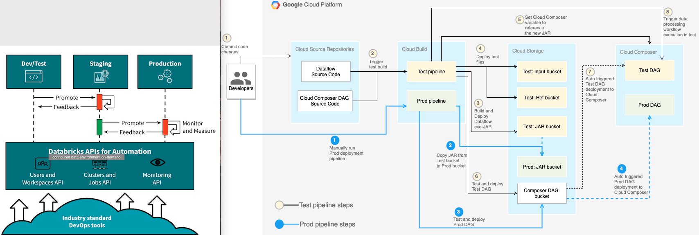

# Architecture
```
- Application (Pipeline)
- Platform (DevOps)
- Infra


```


# Application
```
- Batch

  HDFS          -->        Spark             -->         Hive (BI)
  RDB                      RDD
  FINEOS                   DataFrame
  static files


- Stream

  Kafka         -->        Structured Streaming          -->          HBase (DB)
  FINEOS
 


```


# Platform


Platform图


## Dev
- 代码dev
  - 连接kafka
  - 连接mysql

- Debug
  - connection between IDE and data environment


## Deploy CI/CD
  - CI: GitLab + Jenkins + Job Server RestAPI(返回execution summary)
  - CI + CD (dev, QA, prod 依次部署？？) -> docker kubernetes
  - 没有版本更新 单纯run一遍job
  - 新数据trigger某个job


- Manage多条??: 
  - Nexus repository??
  - CI/CD看同时运行的pipeline？Docker? Monitor??
  - Airflow schedule?？？ 应用场景：新数据trigger某个job？？


## Monitor: 
  - 对象：
    - core infrastructure metrics
    - app performance metrics
    - 同时监控多条运行状态？？？
    - 
  - 目的
    - cluster performance stats
    - design optimizaiton
    - failures alert
    - troubleshoot failures
    
  - 手段
    - Ambari/Yarn/Spark UI
      - metrics
      - 
    - RestAPI
    - Metric Sink + Graphite Gafana
      - metrics
    - logs (specify a location to deliver Spark driver, worker, and event logs)


- Alert: SparkListener 记录log 报警jira 和email


## Fault-tolerance （data pipeline quality??）
  - HA (failure remapping???) 物理资源
    - MasterNode + ZooKeeper
    - Worker


  - 软件架构 
    - exactly once语义
    - spark streaming checkpoint恢复机制？场景：宕机了恢复的过程    
    - kafka offset监控？场景：宕机了从哪开始读 
  
  
  - 代码层面 - log监控???
  


# Infra：
  - Kafka partition
  - HBase 
    - cluster
    - table个数
        
  - 
