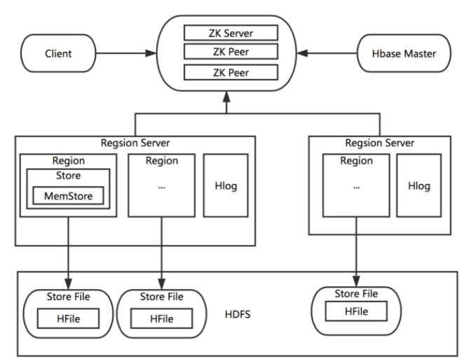

## 表结构
1. 逻辑上：row-key, column family, column qualifier, version(timestamp)
2. 物理上：HFile按CF存储，按照Row-key将相关CF中的列关联起来。然后当用户按照Row-key查询数据的时候，HBase会遍历多个HFile，通过相同的Row-Key标识，将相关的单元格组织成行返回。
 
 
## 架构

## HBase集群
1. Zookeeper
  - HBase Master的HA解决方案
  - Region Server和Region的注册

2. HMaster
  - 协调多个Region Server, 侦测各个Region Server之间的状态，并平衡Region Server之间的负载。
  - 给Region Server分配Region 
  - failover: 一个Master提供服务，其他Master待命。当正在工作的Master节点宕机时，其他的Master接管。

3. HRegionServer：管理表，响应用户IO请求，实现读写操作。
  - HRegion
    - 真实存放数据的地方，HBase分布式的基本单位。每个Region都只存储一个Column Family的数据，并且是该CF中的一段（按Row的区间分成多个Region）
    - Region达到存储数据上限时（Threshold），Region会进行分裂，数据也会分裂到多个Region 中，这样便可以提高数据的并行化，以及提高数据的容量。
    - 每个Region包含着多个Store对象。每个Store包含一个MemStore，和一个或多个HFile。
      - 1. 先写入 MemStore 
      - 2. 当 MemStore 中的数据需要向底层文件系统倾倒（Dump）时，Store便会创建StoreFile（对HFile一层封装），MemStore中的数据会最终写入到HFile中，也就是磁盘 IO。
      - 3. 由于HBase底层依靠HDFS，因此HFile都存储在HDFS 之中。
  - HLog: 数据可靠性, WAL(write-ahead-log)
    - 每个Region Server都有一个HLog的实例。Region Server将更新操作（如Put，Delete）先记录到 WAL（HLog，磁盘顺序写很快），然后将其写入MemStore，最终MemStore会将数据写入到持久化的HFile
   

## [读写流程](https://zhuanlan.zhihu.com/p/65513466)
1. 写流程：
   - 1. Client访问zookeeper, 获取元数据存储所在的regionserver, 拿到对应的表存储的regionserver，去进行数据的添加。
   - 2. 用户数据写入先写WAL，再写memstore，满足一定条件后缓存数据会执行flush操作真正落盘，形成一个数据文件HFile。
   - 3. 当溢写的文件过多时，会触发文件的合并（Compact）操作（使用短时间的IO消耗以及带宽消耗换取后续查询的低延迟）。
   - 4. 当region中的数据逐渐变大之后，达到某一个阈值，会进行裂变, 新Split出来的两个Region会被HMaster分配到相应的HRegionServer上，使得原先1个Region的压力得以分流到2个Region上。
 
 - [compaction](http://hbasefly.com/2016/07/13/hbase-compaction-1/?xslebk=5u0md2): 
   - 所有的更新和删除操作，都是在Compact阶段做的，所以用户写操作只需要进入到内存即可立即返回，从而保证I/O高性能读写。
   - 根据合并规模将Compaction分为了两类：
     - MinorCompaction
     - MajorCompaction
     
2. 读流程：
   - 1. Client访问zookeeper, 获取元数据存储所在的regionserver, 拿到对应的表存储的regionserver，去进行数据的读取。
   - 2. 查找对应的region，在region中寻找列族，先找到memstore，找不到去blockcache中寻找，再找不到就进行storefile的遍历。
   - 3. 找到数据之后会先缓存到blockcache中，再将结果返回。blockcache逐渐满了之后，会采用LRU的淘汰策略。
    

   
## [Row-key设计](https://juejin.cn/post/6844903873824423949)

## Spark load to HBase

