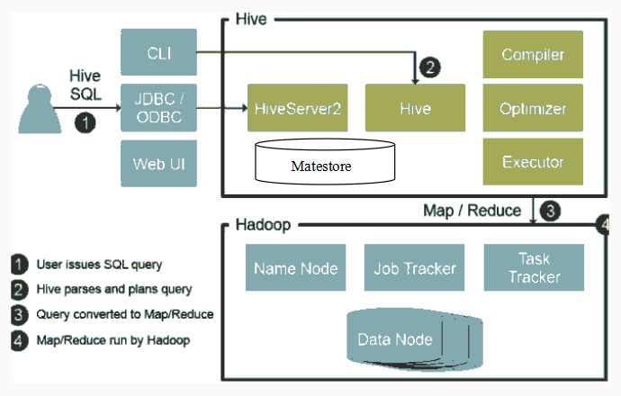

## 架构

  - Compiler：translate HQL into MapReduce
  - Metastore：central repository of metadata (schema on read, indexing)
  
  
## [表类型和文件格式](https://blog.csdn.net/Thomson617/article/details/86153924)
``` SQL
CREATE TABLE page_view(viewTime INT, userid BIGINT, page_url STRING, referrer_url STRING, ip STRING COMMENT 'IP Address of the User')   -- 表类型，字段类型
PARTITIONED BY (dt STRING, country STRING)   -- 分区
CLUSTERED BY(userid) SORTED BY(viewTime) INTO 32 BUCKETS   -- 分桶
STORED AS SEQUENCEFILE;  -- 文件格式

```
  - 表类型
    - managed table(default): metadata and data
    - external table：对hdfs上相应文件的一个引用, 删除操作只删除元数据，不删除数据。
    - partition分区表：提高查询效率，指定分区名进行查找，就不再全表扫描，直接从指定分区中查询。
    - bucket: 分桶是相对分区进行更细粒度的划分，属性哈希值对BUCKET个数取模，设置hive.enforce.bucketiong=true.

  - 文件存储格式：
    - TEXTFILE (default)：数据不做压缩。
    - SEQUENCEFILE：行存储，二进制文件，以K-V的形式序列化到文件里，可压缩和可分割。
    - AVRO：行存储，数据序列化方案。schema存储在JSON格式中，数据以二进制方式存储，文件尺寸最小同时效率最高。
    - ORC
      - 优点：按行分块，按列存储，压缩率比parquet高（parquet数据schema更为复杂），查询效率高。
      - 缺点：不支持嵌套数据（但可通过复杂数据类型如map<k,v>间接实现），不支持字段扩展。Impala不支持ORC，使用Parquet作为主要的列式存储格式。
    - PARQUET
      - 优点：二进制，自解析（metadata），列式存储，snappy压缩，支持嵌套数据格式，支持字段扩展。
             支持谓词下推（predicate pushdown，从磁盘读取数据就过滤数据记录，而不是载入内存再过滤），可以进一步降低磁盘I/O开销。 
      - 缺点：压缩率比ORC低，查询效率比ORC低，不支持update, insert和ACID.


## HiveQL
  - join:
    - (INNEER) JOIN, LEFT (OUTER) JOIN, LEFT SEMI JOIN, CROSS JOIN(笛卡尔积)，FUULL JOIN(不会MAPJOIN优化)
    - MAPJOIN: 大小表,会把小表全部读入内存中，在map阶段直接拿另外一个表的数据和内存中表数据做匹配，由于在map是进行了join操作，省去了reduce运行的效率也会高很多，默认启动优化

  - window function
    - ROW_NUMBER() OVER(PARTITION BY a ORDER BY b)
    - RANK(), DENSE_RANK()
      

## 数据倾斜解决方案
  - map端预聚合
    - hive.map.aggr = true; 相当于combiner
    - hive.groupby.skewindata = true; 两阶段聚合，第一阶段随机分布预聚合，第二个阶段GroupByKey聚合。
  - join
    - 大小表：map join让小表进内存
    - 分拆倾斜key，分别join再union
    - 两阶段聚合（局部聚合+全局聚合)


## 数据库 vs 数据仓库
- RDB(OLTP)随机读写，设计遵循第三范式；DW(OLAP)不需要写多快，复杂查询足够快就行，允许数据冗余。
- s


