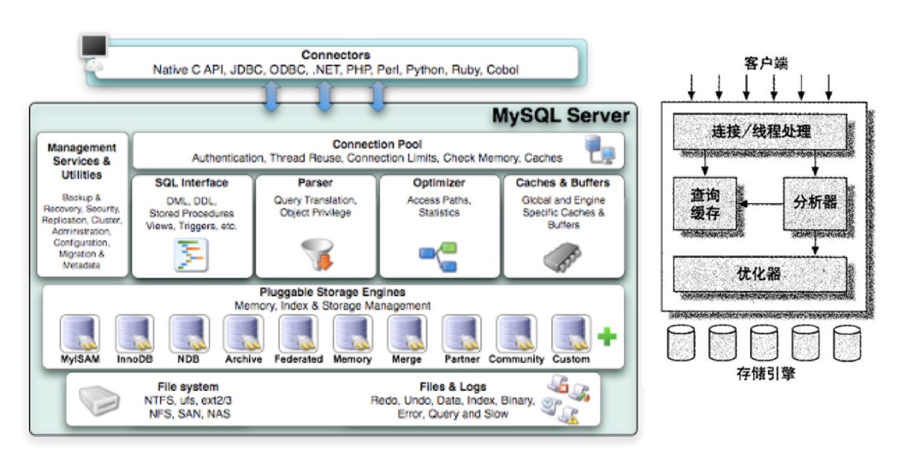

## 架构

1. 应用层
    - 连接处理，用户鉴权，安全管理
    
2. [MySQL服务层](https://zhuanlan.zhihu.com/p/43736857)
    - MySQL Management Server & utilities(系统管理)
    - SQL Interface(SQL 接口)
    - SQL Parser(SQL 解析器)
    - Optimizer (查询优化器)
    - Caches & buffers(缓存)

3. 存储引擎层
    - 存储引擎：InnoDB, MyISAM
    - 物理文件：log(顺序读写), datafile（随机读写）, index

## 索引
1. 利弊
    - 优: 提升检索效率
    - 缺: 索引文件占用磁盘空间，降低了增删改的执行效率。

2. 数据结构
    - [B树](https://www.youtube.com/watch?v=aZjYr87r1b8&ab_channel=AbdulBari): 
        - 多路平衡查找树
        - 内部节点有record pointer
    - B+树: 
        - 内部节点无record pointer，只有叶子节点有record pointer -> 磁盘IO次数少，查询效率高              
        - 叶子节点LinkedList -> b+范围扫描简单，b则需要在叶子节点和内部节点往返移动
       
    - hash:不支持模糊查找，不支持范围查找，哈希冲突查询效率低

            
3. 类型
    - 主键索引 - 一种特殊的唯一索引，一个表只能有一个主键，不允许有空值。一般是在建表的时候同时创建主键索引。
              - [主键索引和非主键索引](https://mp.weixin.qq.com/s/RemJcqPIvLArmfWIhoaZ1g)
    - 普通索引 - 直接创建/修改表结构的方式添加索引/创建表的时候同时创建索引
    - 唯一索引 - 索引列的值必须唯一，但允许有空值。如果是组合索引，则列值的组合必须唯一。通常为避免数据重复，而不是提高访问速度。
    - 全文索引 - 主要用来查找文本中的关键字，而不是直接与索引中的值相比较。
    - 组合索引
        - 只有在查询条件中使用了创建索引时的第一个字段，索引才会被使用。
        - 最左匹配(col1, col2, col3) -> (col1), (col1, col2), (col1, col2, col3)

## 事务
1. ACID
2. 并发执行的事务：
    - [锁](https://juejin.cn/post/6844903505283514381#heading-5)
        - 读锁，写锁
        - 共享锁，排他锁
        - 乐观锁，悲观锁
        - 行锁，表锁
        - [死锁](https://www.cnblogs.com/tgycoder/p/5410537.html)

    - 隔离级别
        - Read uncommitted：一个事务会读到另一个事务更新后但未提交的数据，如果另一个事务回滚，那么当前事务读到的数据就是脏数据，这就是脏读（Dirty Read）。
        - Read committed
            - 在一个事务内，多次读同一数据，在这个事务还没有结束时，如果另一个事务恰好修改了这个数据，那么，在第一个事务中，两次读取的数据就可能不一致。
            - 不可重复读重点在于update和delete，而幻读的重点在于insert。
        - Repeatable read
            - 在一个事务中，第一次查询某条记录，发现没有，但是，当试图更新这条不存在的记录时，竟然能成功，并且，再次读取同一条记录，它就神奇地出现了。(幻读)
            - 在可重复读中，该sql第一次读取到数据后，就将这些数据加锁，其它事务无法修改这些数据，就可以实现可重复读了。
              但这种无法锁住insert的数据，即当事务A先前读取或修改了数据，事务B还是可以insert数据提交，这时事务A就会发现莫多了一条之前没有的数据，这就是幻读，不能通过行锁来避免。
        - Serializable：是最严格的隔离级别。在Serializable隔离级别下，读用读锁，写用写锁，读锁和写锁互斥，所有事务按照次序依次执行，因此，脏读、不可重复读、幻读都不会出现。

## 表

1. 表类型
    - 临时表：临时表是建立在系统临时文件夹中的表，如果使用得当，完全可以像普通表一样进行各种操作。临时表的数据和表结构都储存在内存之中，退出时，其所占的空间会自动被释放。
    - 派生表：派生表是从SELECT语句返回的虚拟表，每次query都重复执行。
    - 视图：
        - 建立视图来简化操作不用每次重复执行一段重复代码，因为视图把查询语句虚拟成一个虚表来供我们操作数据库中只存放视图的定义而不存放视图对应的数据，这些数据仍然存放在之前的表中
        - 视图在概念上与基本表等同，用户可以在基本表那样使用视图，可以在视图上再定义视图。
        - 视图不可以创建索引，索引只能创建在占有存储空间的对象上

2. 表操作
    - DQL(query)
    - DML(manipulation): 插入，更新，删除
    - DDL(definition): 创建表，视图，索引
    - DCL(control): commit, rollback

3. DQL(query)
    - 语法：
        - SELECT DISTINCT xx
        - FROM xx JOIN xx ON xx WHERE xx
        - GROUP BY xx SUM(xx) HAVING xx ORDER BY xx
    - 函数：
        - 时间：
            - 格式转换：
                - MySQL -> [DATE_FORMAT](https://www.w3school.com.cn/sql/func_date_format.asp)('2021-02-20', '%Y-%m -> %W')
                - SQL Server -> [DATENAME](https://www.w3school.com.cn/sql/func_datepart.asp)(w, '2021-02-20')
            - 比较：MIN, MAX
        - 窗口：DENSE_RANK() OVER(PARTITION BY DepartmentId ORDER BY Salary DESC) AS 'Rank'
        - 其他：[CAST](https://www.w3schools.com/sql/func_mysql_cast.asp)(x AS DATATYPE), [CONCAT](https://www.w3schools.com/sql/func_mysql_concat.asp)(x, x, x)

    - 执行顺序：
        - 1. FROM xx JOIN xx ON xx WHERE xx
        - 2. GROUP BY xx SUM(xx) HAVING xx
        - 3. SELECT DISTINCT xx ORDER BY xx DESC

    - [查询很慢](https://www.cnblogs.com/kubidemanong/p/10734045.html)
        - 偶尔很慢：
            - 同步数据到磁盘
            - 加锁
        - 一直很慢：
            - 索引
                - 字段没有索引
                - 索引失效：索引字段做运算或函数操作
                - 索引选择：主键索引和非主键索引
            - 分区

## 分区
1. 优点：
    - scalable
    - search efficiency

2. 种类
    - horizontal水平分区
        - [种类：RANGE, LIST, HASH, composite](https://blog.csdn.net/u013096088/article/details/72821849)
        - 算法：[一致性哈希](https://segmentfault.com/a/1190000021199728)
            - 哈希环，只有少部分对象需要重新分配（对比简单取模，添加服务器，大部分缓存失效）
            - 虚拟节点：解决负载不均衡
            
        
    - vertical垂直分区（MySQL不支持，HBase支持）

