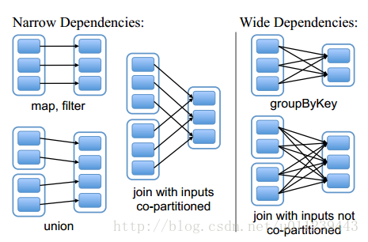

## 架构
```   

Application --------------------- Cluster Manager --------------------- Worker Node
Driver                            Standalone                            Executor
SparkContext                      Yarn                                  Task

DAGScheduler 
TaskScheduler
Job -> Stage -> Task

```
---


## 运行原理
1. 流程：
  - 构建SparkApplication的运行环境（启动SparkContext），SparkContext向ResourceManager（可以是Standalone、YARN）注册并申请运行Executor资源。（Application不能跨应用程序共享数据）
  - DAGScheduler构建成DAG图，将DAG图分解成Stage，并把Taskset发送给TaskScheduler(内部维护一个任务队列，根据FIFO或Fair策略，调度任务)。
  - TaskScheduler将Task发放给Executor运行，同时SparkContext将应用程序代码发放给Executor（计算移动）。

2. 参数
```txt
spark-submit 
  -- class
  -- master           // master URL for the cluster
  -- deploy-mode      // client or cluster
  <application-jar>
  [appliccation-arguments]
  
  -- num-executors
  -- totoal-executor-cores  
  -- executor-memory
  
```
  - deploy-mode
    - client(default): Driver进程运行在Master节点上
      - 适合Master和Worker集群在同一个网络内；
      - Driver进程运行在Master节点上, 没有监督重启机制，Driver进程如果挂了，需要额外的程序重启; 
      - 适合REPL交互（spark shell）
    - cluster: Driver程序在worker集群中某个节点
      - minimize network latency between the drivers and the executors
      - Master可以使用–supervise对Driver进行监控，如果Driver挂了可以自动重启


## DAG
1. 宽窄依赖        
  
  - 宽依赖：一个父RDD partition对应多个子RDD partition, 有shuffle(一个父分区经过shuffle划分到子RDD不同分区)
  - 窄依赖：一个父RDD partition对应一个子RDD partition.
  
2. stage
  - 一个action会生成一个job
  - 一个job根据宽依赖划分成多个stage
  - stage内部多个tasks（stage内部窄依赖，pipeline），然后这些task提交给executor进行计算执行（结果返回给Driver汇总或存储）。
  
 
 
---
## RDD 
1. partition
  - partition个数 = task个数
  - 理论上最好是k * (#of executors * #of cores for each executor)，充分利用集群资源
  - 实际上
    - 在map端，比如读取HDFS数据，sc.textFile(path, minPartitions)，partition个数默认block数，如果指定minPartitions则为该值
    - reduce端，task个数 = stage第一个rdd(shuffledRDD)partition数，该值又取决于Partitioner，默认参数spark.defalut.parallelism, spark.sql.shuffle.partitions，
      可以显示指定，比如reduceByKey(partitioner, func), reduceByKey(func, numPartitions)
      
2. 容错性(Resilient)
  - 基于lineage: 一个RDD出错，那么可以从它的所有父RDD重新计算所得，如果一个RDD仅有一个父RDD（即窄依赖）,那么这种重新计算的代价会非常小。
  - 基于checkpoint: 宽依赖得到的结果是很昂贵的，Spark将此结果持久化到磁盘上了，以备后面使用。
  
  
3. transformations & actions
  - transformation(lazy)
    - map, flatmap(一对多), mapPartitions
    - reduceByKey（预聚合）, distinct, groupByKey, aggregateByKey, sortByKey, sortBy, coalesce, repartition, join, cogroup, intersection, subtractByKey
    - cache, persist 
      - cache = persist(MEMORY_ONLY)
      - persist指定缓存方式: MEMORY_ONLY, MEMORY_AND_DISK, MEMORY_ONLY_SER, MEMORY_AND_DISK_SER, DISK_ONLY
      - persist、cache与checkpoint的区别：persist持久化不改变lineage, checkpoint执行后只有一个checkpointRDD；persist持久化到磁盘或内存，checkpoint通常保存到hdfs

  - action
    - reduce, count, take, collect, foreach
    - saveAsTextFile
    

## Shuffle
1. partitioner
  - HashPartitioner(default), 算法hash(key)% reduce tasks, 数据倾斜
  - RangePartioner(采样，均衡分割点）
  
2. shuffle算子
  - 聚合 reduceByKey, distinct, groupByKey, aggregateByKey
  - 排序 sortByKey, sortBy
  - 重分区 coalesce, repartition
  - 表操作 join, cogroup intersection, subtractByKey
  
3. 数据倾斜
  - 弊端：无法充分并行，oom
  - 解决方案
    - 预聚合 reduceByKey(combiner)代替groupByKey(没有combiner)
    - join避免shuffle
      - co-partition (如果join之前，rdd1进行reduceByKey, 将此partitioner设置为另外一个rdd2的partitioner)
      - broadcast + map (大小表)
      - hot key  
        - 几个数据量过大的key：采样倾斜key并分拆join操作，最后union。
        - 大量倾斜key：两阶段聚合（局部聚合+全局聚合），将原本相同的key通过附加随机前缀的方式，变成多个不同的key，就可以让原本被一个task处理的数据分散到多个task上去做局部聚合，进而解决单个                        task处理数据量过多的问题。接着去除掉随机前缀，再次进行全局聚合，就可以得到最终的结果。
                
4. [shuffle机制（序列化，磁盘io，网络io）](https://zhuanlan.zhihu.com/p/70331869)
  - HashShuffleManager
    - consolidate机制
  - SortShuffleManager
    - 普通
    - bypass机制


## 性能调优
1. 重复使用rdd持久化（重新计算RDD的时间资源与缓存RDD的内存资源之间进行权衡）
2. 高性能算子
  - 使用mapPartitions替代普通map，特别是在写DB的时候，避免每条写记录都new一个connection
  - 使用filter之后进行coalesce操作，减少小文件数量
3. 解决数据倾斜


  
## Shared variables
1. broadcast：
  - 在每台计算机上保留一个只读变量，而不是将其副本与任务一起发送。
  - 应用场景：broadcast+map代替join
2. accumulator
  - 变量副本传到远程集群执行，这些变量更新不会传回driver（计算移动)。driver可以读取累加器的值。
  - 一个比较经典的应用场景是用来在Spark Streaming应用中记录某些事件的数量  
  
  


---

## MapReduce vs Spark
1. 运算：MapReduce基于磁盘（中间结果落到磁盘，IO、序列化反序列化开销大），SparkRDD基于内存（存取速度快）
2. 编程范式：Map+Reduce vs Transformation+Action
3. Task: MapReduce task以进程维护（数秒启动），Spark以线程维护

  

## topK全局有序
1. sortByKey + partitioner
  - partitioner根据数据范围来分区，使得p1所有数据小于p2，p2所有数据小于p3, sortByKey保证partition内部有序
2. heap


---
  
## RDD, DF, DS
[详见](https://blog.csdn.net/muyingmiao/article/details/102963103)


# Streaming

- structured streaming read from kafka
```scala
val df = spark
  .readStream
  .format("kafka")
  .option("kafka.bootstrap.servers", "host1:port1,host2:port2")
  .option("subscribe", "topic1,topic2")           // multiple topics
  .option("startingOffsets", """{"topic1":{"0":23,"1":-2},"topic2":{"0":-2}}""")
  .option("endingOffsets", """{"topic1":{"0":50,"1":-1},"topic2":{"0":-1}}""")
  .load()                                         // default #of consumer instances = #of partition number = #of topic partitions
  
df.selectExpr("CAST(key AS STRING)", "CAST(value AS STRING)")   
  .as[(String, String)]                           // k-v

```

- stream operations
```scala

val windowedCounts = words
    .withWatermark("timestamp", "10 minutes")               // watermark: 在12:20trigger时, watermark 为 12:21 - 10m = 12:11，所以late data (12:04, donkey)丢弃了。
    .groupBy(
        window($"timestamp", "10 minutes", "5 minutes"),    // window: 窗口大小10分钟，每5分钟trigger一次
        $"word")
    .count()

```
  - window: aggregation 
  - watermark: late data(ProcessingTime比EventTime晚），更新其对应的ResultTable的记录。
  


- write stream to hbase
```scala
val query = df.writeStream
  .option("checkpointLocation", "path/to/checkpoint/dir")
  .trigger(Trigger.ProcessingTime("10 seconds"))  // trigger
  .foreach(writeToHBase)          //
  .outputMode("complete")                         // 输出模式
  .start()                                     
  .awaitTermination()

```

  - trigger模式
    - micro-batch(default): exactly-once 语义。原因是因为在input端和output端都做了很多工作来进行保证幂等。
    - continuous mode: at-least-once(处理完才commit, 处理错误会重操作。需要保证幂等性（两次处理不会影响系统）)
    
  - 三种输出模式
    - 附加模式（Append Mode）(default)：上一次触发之后新增加的行才会被写入外部存储，老数据有改动不适合该模式
    - 更新模式（Update Mode）：上一次触发之后被更新的行才会被写入外部存储
    - 完全模式（Complete Mode）：整个更新过的输出表都被写入外部存储


